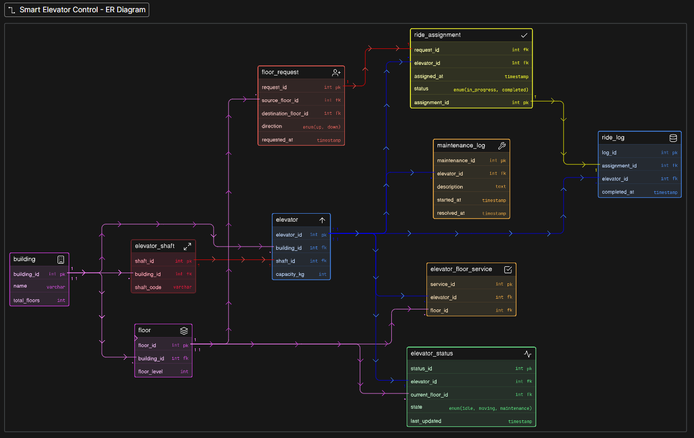

# Smart Elevator Control - Database Design

Designing a database for an enterprise elevator control system requires treating it as an **IoT (Internet of Things) platform**. Unlike a standard CRUD app, an elevator system generates high-velocity telemetric data. 

To ensure the system remains highly performant and scalable across multiple high-rise buildings, the database was designed around the strict separation of **Static Configuration**, **Live Telemetry**, and **Historical Archives**.

---

## ER Diagram

---

## 🔗 Eraser Diagram Link
https://app.eraser.io/workspace/TKgGfPcDIeYlJU1CW8Mq?origin=share

---

### 1. Data Separation
The most critical design choice was preventing dynamic ride data from bloating the core hardware tables.
* **Static Configuration:** The `elevator` table only stores physical hardware specs (e.g., `capacity_kg`). Things that require a mechanic to change.

* **Live Telemetry:** The `elevator_status` table is isolated as a strictly 1-to-1 relationship. This allows the system to run thousands of `UPDATE` queries per minute (changing `current_floor_id` or `motion_state`) without locking the main configuration tables.

* **Historical Archives:** Completed trips are moved to the `ride_log` table. This keeps the active tables lightweight while preserving a permanent historical record for big data analytics.

### 2. Solving Complex Floor Routing (Many-to-Many)
In high-rise corporate towers, not every elevator goes to every floor. Some are "Express" (serving only floors 1, 40, and 50), while others are "Service" (serving all floors). 

* **The Solution:** I introduced the `elevator_floor_service` junction table. This maps exactly which elevator has access to which floor, granting building managers infinite flexibility to configure routing zones without altering the database schema.

### 3. Simple Explain
When a user presses a button on the 5th floor, they are creating a *request*, not a *ride*. The database models this real-world gap:
* A `floor_request` is generated first. It has no idea which elevator will pick the user up.
* The backend dispatcher algorithm calculates the most efficient route and generates a `ride_assignment`, creating a strict 1-to-1 link between the user's request and a specific `elevator_id`.

### 4. Non-Destructive Maintenance Tracking
If an elevator breaks down, we need to stop assigning it rides immediately, but we also need to keep a permanent record of the repair.
* **The Solution:** The backend updates the `elevator_status` to `maintenance` (stopping new ride assignments instantly) while simultaneously creating a detailed timestamped entry in the `maintenance_log` table. This ensures maintenance history is tracked permanently without overwriting the elevator's core identity.

---

## Summary
* **Multi-Building Scalability:** The hierarchical flow of `building` ➔ `elevator_shaft` ➔ `elevator` supports a global portfolio of properties.
* **Real-Time Monitoring:** Dashboards can instantly query the `elevator_status` table to see exactly where every car is in the building right now.
* **Audit Ready:** Every button press, ride completion, and maintenance window is logged perpetually for safety audits and performance tuning.